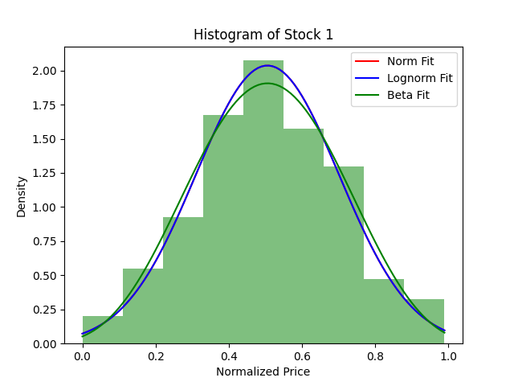
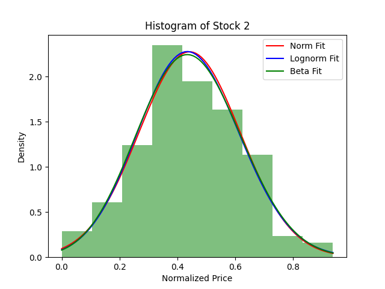

# CS5060 Program3

## Team
- Ann Marie
- Briton Ellis
- Madison Patch
- Nate Stott

## Discussion

### Part 1: Fitting Stock Data to Distributions

#### Graphs:
### Figure 1.1

### Figure 1.2

### Part 2: Monte Carlo Simulation for Vanilla European Option Pricing

### Part 3: Stochastic Jumps and Basket Option Pricing

